 

### 👩‍💻 About Me

I'm a Computer Science Engineer passionate about building real-world applications using **AI, Full Stack Development, and automation**. I enjoy turning ideas into practical, working products and continuously exploring new technologies.

Currently, I'm building [**CareerPilot-AI**](https://github.com/HarinirajanT/CareerPilot-AI), an AI-powered career assistant focused on **resume tailoring, ATS optimization, cover letter generation, job matching, and interview preparation**.

- 🔭 Currently building: **CareerPilot-AI** — an AI-powered career assistant
- 🌱 Currently exploring: **Generative AI, LLMs, AI Agents, FastAPI & React**
- 💻 Comfortable with: **Python, JavaScript, TypeScript, React, FastAPI, SQL**
- 🤖 Interested in: **AI/ML, Generative AI, Full Stack Development & Automation**
- 💬 Ask me about: **Python, Full Stack Development, AI-powered applications & APIs**
- 📫 Reach me: [**LinkedIn**](https://www.linkedin.com/in/harini-t-853aa4263/) · [**Email**](mailto:harinirajan2004t@gmail.com)

---

### Featured Projects

| Project | Stack | What it does |
|---|---|---|
| **[CareerPilot-AI](https://github.com/HarinirajanT/CareerPilot-AI)** | Python | AI-powered career assistant — resume tailoring, ATS optimization, cover letter generation, interview prep, career insights |
| **[harini-portfolio](https://github.com/HarinirajanT/harini-portfolio)** | JavaScript | Recruiter-focused personal portfolio site |
| **[puthu-roja-orchestra](https://github.com/HarinirajanT/puthu-roja-orchestra)** | TypeScript | Live music orchestra portfolio website (Kovilpatti, Tamil Nadu) — real client project |
| **[ai-judiciary-assistant](https://github.com/HarinirajanT/ai-judiciary-assistant)** | JavaScript | AI-assisted judiciary/legal support tool |
| **[chat-app](https://github.com/HarinirajanT/chat-app)** | JavaScript | Real-time chat application |
| **[Expense_tracker](https://github.com/HarinirajanT/Expense_tracker)** | JavaScript | Personal expense tracking app |

---

### GitHub Stats

---

### Contribution Snake

<picture>
<source media="(prefers-color-scheme: dark)" srcset="https://raw.githubusercontent.com/HarinirajanT/HarinirajanT/output/github-contribution-grid-snake-dark.svg" />
<source media="(prefers-color-scheme: light)" srcset="https://raw.githubusercontent.com/HarinirajanT/HarinirajanT/output/github-contribution-grid-snake.svg" />

</picture>

 

